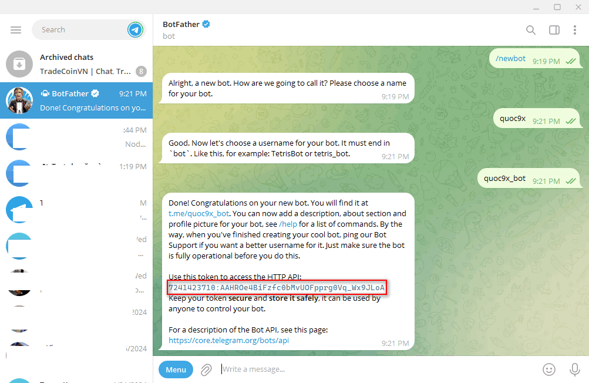
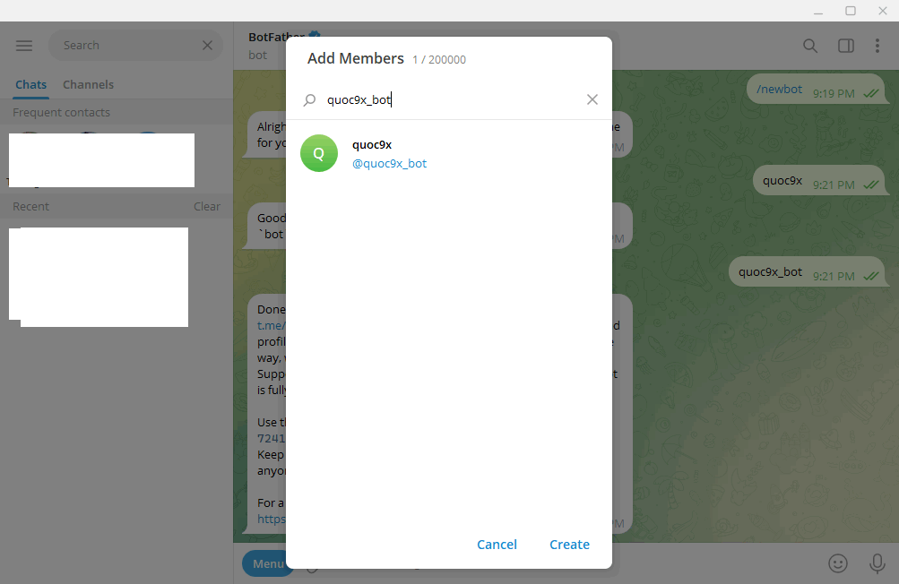
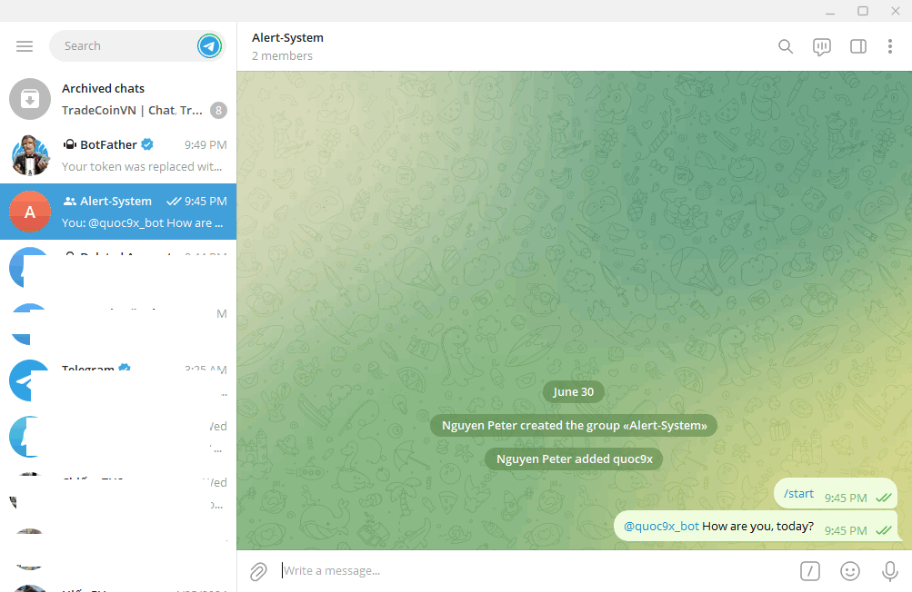
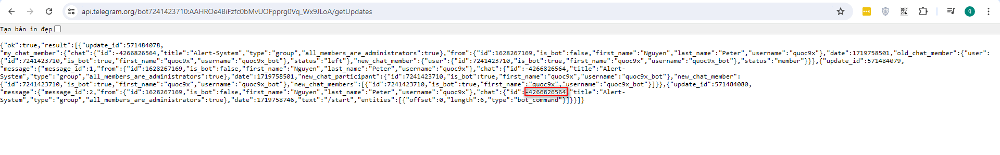

# prometheus-stack-docker


# Alert manager
## Alert qua email

- Bật 2FA cho email
- Vào đây để tạo app password https://myaccount.google.com/u/0/apppasswords
- Copy password đã tạo vào phần `auth_password`

Note: Option `Less secure apps` đã bị disabled.


## Alert qua telegram
- Tạo bot telegram với @BotFather: Gõ BotFather ở thanh tìm kiếm và chat với nó để tạo bot

     

- Lưu lại token (Lưu ý: không nên để lộ token của bot, nếu lộ thì có thể chat với BotFather để revoke token)

- Tạo một group và add bot vừa tạo vào

      

- Ở trong group vừa tạo gõ `/start`, Sau đó vào link bên dưới để lấy ChatID của group

  https://api.telegram.org/bot$BOT_TOKEN/getUpdates    
  Ex:   
  https://api.telegram.org/bot7498607478:AAFub3sFqpw1rnj-Ni7IByYrV36UvYc-7nw/getUpdates


      

      

- Điền TOKEN và ChatID vào config của alert manager

```
...
- name: 'telegram'
  telegram_configs:
    - bot_token: '7498607478:AAFub3sfjdw1rnj-Ni7IByYrV67EvYc-7zv'
      api_url: https://api.telegram.org
      chat_id: -4220896623
      message: '{{ template "telegram.yucca.message" . }}'
...
```


References:
https://www.teleme.io/articles/create_your_own_telegram_bot?hl=vi